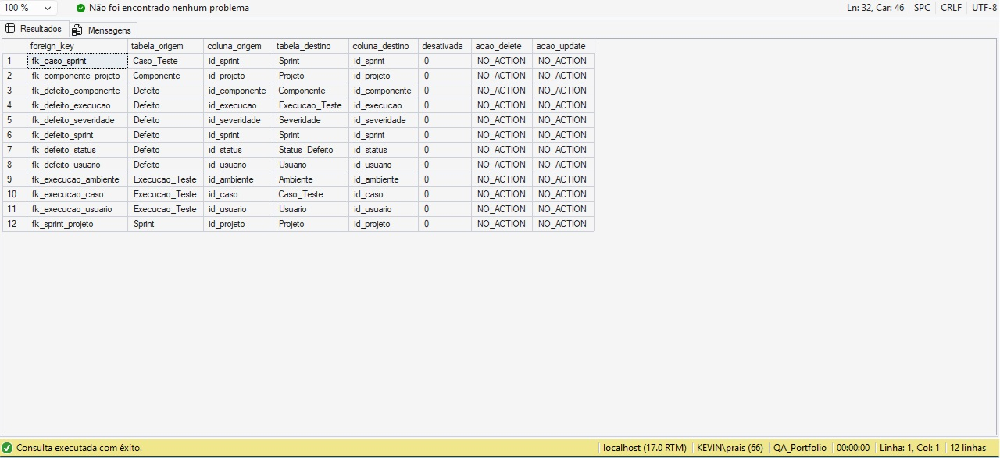
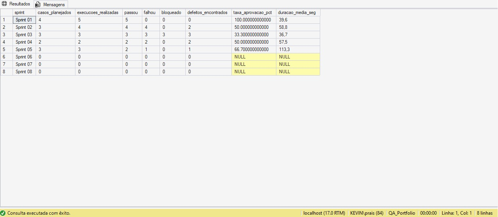
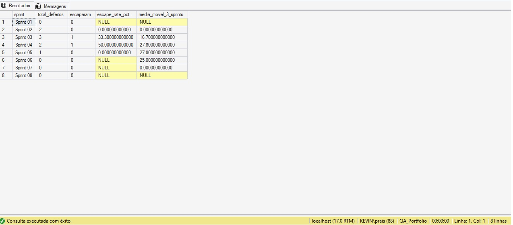
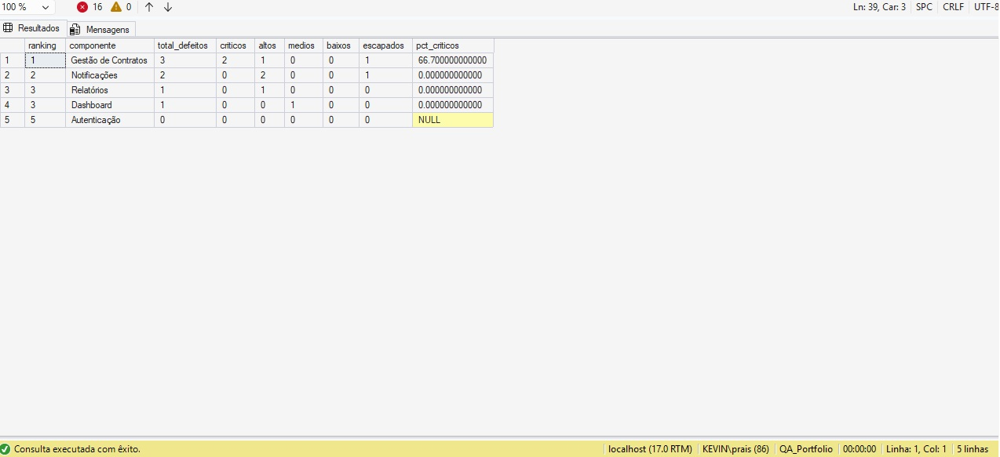
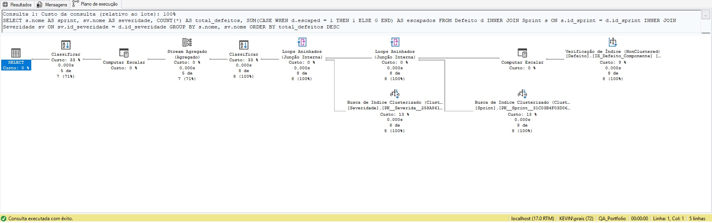
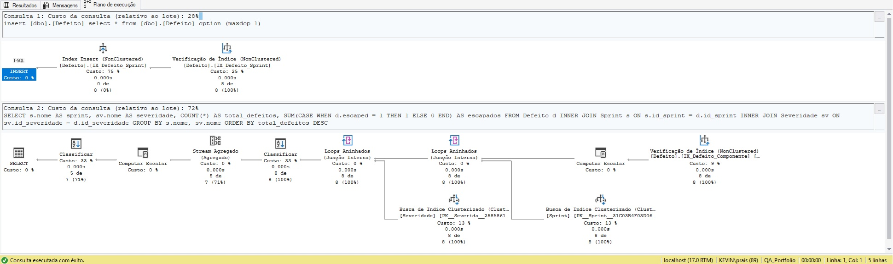

# 🗃️ QA Database Portfolio — SQL Server

Banco de dados relacional construído do zero para demonstrar proficiência em **SQL Server**, modelagem relacional e análise de dados aplicada ao contexto de Quality Assurance.

O projeto simula um sistema real de gestão de testes e defeitos, com dados fictícios coerentes, e responde perguntas de negócio relevantes para times de QA.

---

## 📐 Modelagem

O banco foi projetado para refletir o fluxo real de um time ágil:

**Projeto → Sprint → Caso de Teste → Execução → Defeito**

Decisões de design relevantes:
- `Execucao_Teste` é separada de `Caso_Teste` para permitir múltiplas execuções do mesmo caso em diferentes sprints e ambientes
- O campo `escaped` em `Defeito` rastreia defeitos que passaram pela QA e foram encontrados em produção — base do cálculo de *defect escape rate*
- Todas as tabelas de domínio (severidade, status, ambiente) são normalizadas para evitar dados duplicados e facilitar extensão

### Diagrama de Entidade-Relacionamento



---

## 📁 Estrutura do Repositório

```
sql-db-qa/
├── 01_schema/          # DDL: criação do banco, tabelas, índices e FKs
├── 02_seed/            # DML: dados fictícios para demonstração
├── 03_programabilidade/# Views, Stored Procedures, Functions e Triggers
├── 04_analises/        # Queries que respondem perguntas de negócio
├── 05_performance/     # Comparação de execution plan antes/depois de índice
└── docs/               # Prints de evidência e diagramas
```

---

## ▶️ Como executar

> Requisito: SQL Server 2022+ e SSMS instalados.

Execute os scripts na ordem abaixo:

```sql
-- 1. Cria o banco
01_schema/01_create_database.sql

-- 2. Cria as tabelas
01_schema/02_tables.sql

-- 3. Cria os índices
01_schema/03_indexes.sql

-- 4. Valida as foreign keys
01_schema/04_foreign_keys.sql

-- 5. Popula os dados
02_seed/01_seed_lookup.sql
02_seed/02_seed_projeto.sql
02_seed/03_seed_sprint.sql
02_seed/04_seed_casos.sql
02_seed/05_seed_execucoes.sql
02_seed/06_seed_defeitos.sql

-- 6. Cria views, procedures, functions e triggers
03_programabilidade/01_views.sql
03_programabilidade/02_stored_procedures.sql
03_programabilidade/03_functions.sql
03_programabilidade/04_triggers.sql
```

---

## 📊 Análises — Perguntas respondidas pelo banco

### 1. Como evoluiu a qualidade ao longo das sprints?

Query: `04_analises/01_metricas_sprint.sql`



A Sprint 01 iniciou com 100% de aprovação. A qualidade caiu progressivamente até a Sprint 03 (33% de aprovação, 3 defeitos) e começou a se recuperar na Sprint 05.

---

### 2. Quais sprints deixaram defeitos escaparem para produção?

Query: `04_analises/02_defect_escape_rate.sql`



Sprint 03 registrou **33% de escape rate** e Sprint 04 **50%** — ambas concentraram defeitos críticos nos componentes de Gestão de Contratos e Notificações.

---

### 3. Quais componentes concentram mais defeitos?

Query: `04_analises/05_ranking_componentes.sql`



**Gestão de Contratos** lidera com 3 defeitos, sendo 66% classificados como críticos e 1 escapado para produção — sinalizando necessidade de maior cobertura de testes neste módulo.

---

## ⚙️ Programabilidade SQL Server

### Stored Procedures
- `sp_registrar_execucao` — registra execução e abre defeito automaticamente se o resultado for `Falhou`. Usa `TRY/CATCH` e transação explícita.
- `sp_fechar_defeito` — fecha defeito com validação de estado e rollback em caso de erro.

### Functions
- `fn_defect_escape_rate(@id_sprint)` — retorna o percentual de defeitos escapados de uma sprint
- `fn_cobertura_sprint(@id_sprint)` — retorna o percentual de casos executados
- `fn_historico_caso(@id_caso)` — table-valued function com histórico completo de execuções de um caso

### Views
- `vw_dashboard_sprint` — resumo executivo de qualidade por sprint
- `vw_defeitos_abertos` — lista operacional com dias em aberto
- `vw_cobertura_testes` — cobertura planejada vs executada por sprint

### Trigger
- `trg_audit_defeito` — audit log automático que registra toda alteração de status, severidade ou campo `escaped` na tabela `Audit_Defeito`

---

## 🚀 Performance — Impacto de índice

A query de análise de defeitos por sprint foi executada com e sem o índice `IX_Defeito_Sprint` para demonstrar o impacto no execution plan.

| Cenário | Operação |
|---|---|
| Sem índice | Table Scan |
| Com índice | Index Seek |

**Antes:**


**Depois:**


Scripts: `05_performance/before_index.sql` e `05_performance/after_index.sql`

---

## 🛠️ Stack

- **SQL Server 2025 Developer Edition**
- **SSMS 22**
- T-SQL: CTEs, Window Functions, Stored Procedures, Triggers, Table-Valued Functions

---

*Projeto desenvolvido como portfólio técnico de SQL Server aplicado à área de Quality Assurance.*
```
